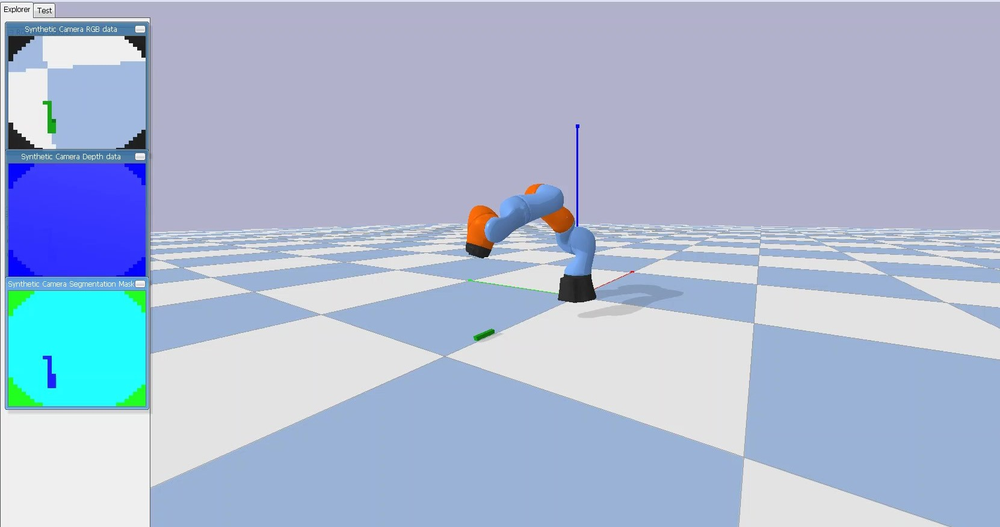

# Robotic_Arm_DQN

_Work in Progress (That includes the README.md file)_

Trains a _[Kuka LBR iiwa](https://www.kuka.com/en-au/products/robotics-systems/industrial-robots/lbr-iiwa)_ robotic arm through the reinforcement learning algorithm, Deep Q-Network, within the [PyBullet](https://pybullet.org/wordpress/) Simulation Environment.

> Yet to exhibit intelligent motion. Steps forward:
> - Upgrade DQN learning algorithm to [Double-DQN](https://arxiv.org/abs/1509.06461), [Duelling-DQN](https://arxiv.org/abs/1511.06581), or both.
> - Upgrade CNN to [CapsNet](https://arxiv.org/abs/1710.09829).
> - Tile joint state before concat, as done in [this](https://arxiv.org/abs/1603.02199) paper.